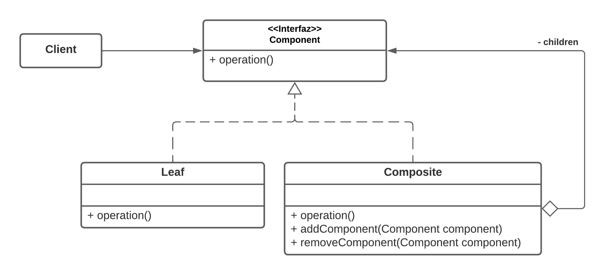

# Patron Composite
## Definicion
__*El patron composite compone objetos en una estructura de arbol para representar jerarquias "parte-todo", ademas de permitir tratar tanto a objetos compuestos como simples de forma uniforme.*__

## Estructura

### Vista estatica - Diagrama de clases UML

#### Actores

__Component:__ Declara una interfaz para los componentes de las estructura.

__Leaf:__ Implementa Component. Define la operacion para objetos primitivos, es decir, que no poseen hijos.

__Composite:__ Implementa Component. Define la operacion para objetos complejos, es decir, que poseen hijos. Generalmente se encargan de propagar la solicitud de operacion hacia sus hijos y de realizar algun trabajo adicional antes de elevar el resultado.

__Client:__ Interactua con la estructura de forma uniforme a traves de la interfaz Component, sin importar si se trata de un objeto simple o de uno compuesto.

## Consecuencias

__*Escalabilidad horizontal de componentes*__. Se pueden agregar nuevos objetos del tipo Leaf y Composite sin afectar a los que ya existen, dado que todos siguen la misma interfaz, todos pueden ser tratados de igual forma con respecto a la operacion que realizar.

__*Polimorfismo en lugar de condicionales*__. Facilita trabajar con estructuras complejas al poder tratar de igual forma tanto a objetos complejos, como simples, en lugar de hacer uso de estructuras condicionales para determinar la accion a tomar segun el tipo de objeto.

